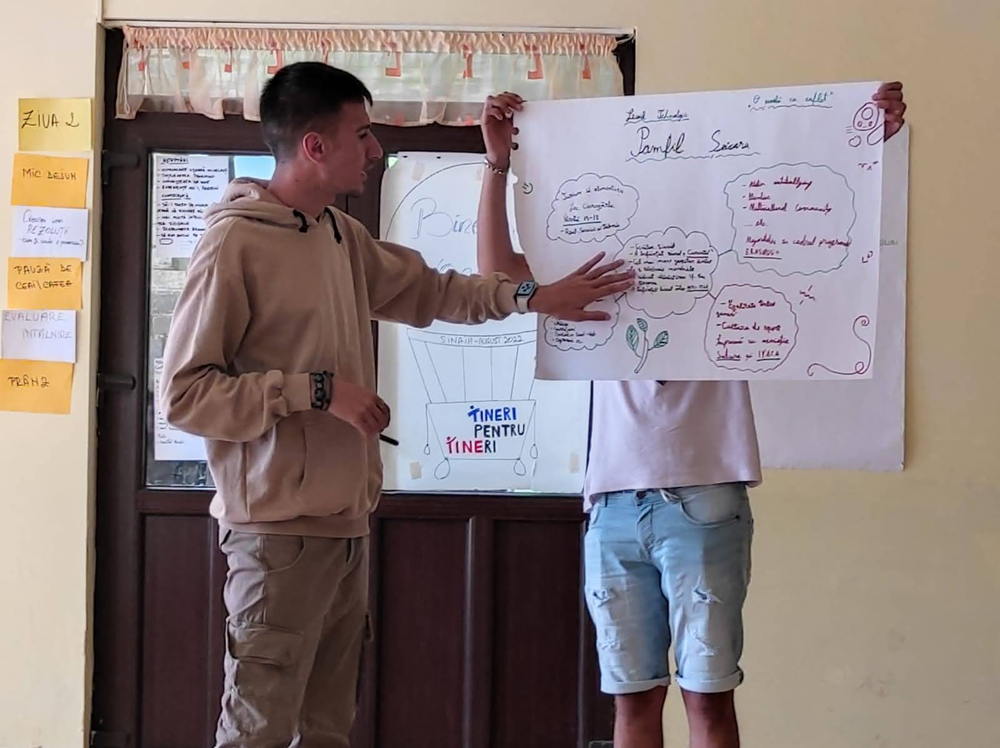
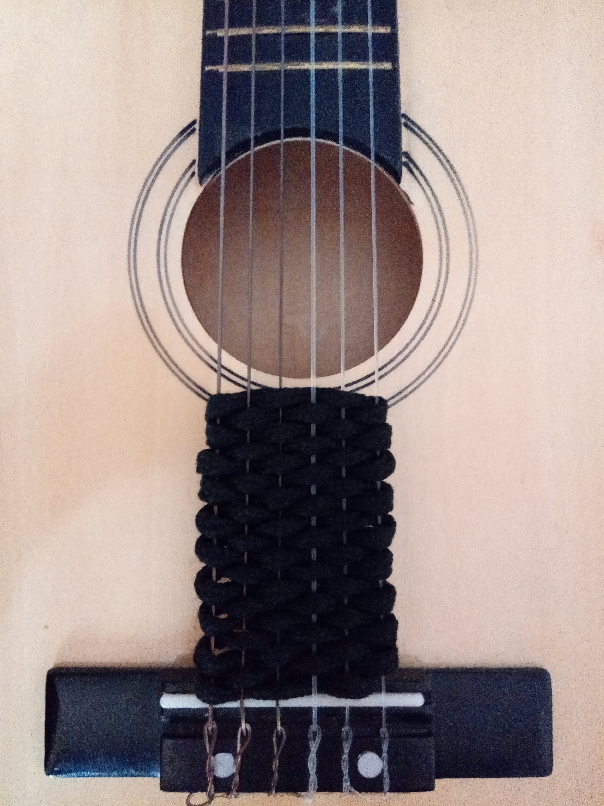

# Student

I study at the [Faculty of Foreign Languages and Literatures](https://flls.unibuc.ro).
Currently studying English and Slovak. I am aiming to not only help myself,
but also help other students and the faculty in any way I can.

# Volunteering

Volunteering helped me shape up to be what I am. I own 3 youthpasses. I traveled to 
[Ankara](https://en.wikipedia.org/wiki/Ankara), [Istanbul](https://en.wikipedia.org/wiki/Istanbul),
[Sinaia](https://ro.wikipedia.org/wiki/Sinaia) and much more. 

# Music

I love music. From Country, Indie and Jazz to Rock, Pop and Phonk. I also
love to make music. Music has always been a way for me to express my 
feelings, stories and love.

# Drawing

I also love simple, minimalist art. The "just enough to express".
I have numerous drawings but I keep them to myself as a private
wallpaper gallery. 